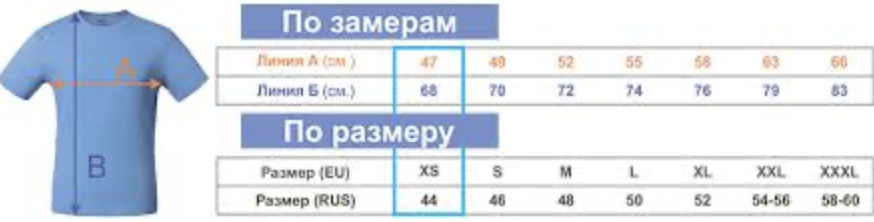

## Интерфейсы Comparator и Comparable

### Цель урока:
- `Comparator` и `Comparable` что это за интерфейсы и зачем они нужны?
- Реализация сортировки объектов с помощью этих интерфейсов
- Различия между `Comparator` и `Comparable`

### Структура урока:

#### 1. Введение
- **Пример из жизни**:  
  Представьте, что у вас есть список студентов, и вам нужно отсортировать их по имени, возрасту или оценкам. Как это сделать, если список содержит объекты, а не простые числа или строки? Или вам поручили реализовать сортировку по размеру `s, m, l, xl` в интернет магазине футболок
  
  



- **Терминология**:
  - `Comparable` — это интерфейс, который позволяет объекту "сравнивать себя" с другими объектами (например, сортировка по умолчанию).
  - `Comparator` — это интерфейс, который позволяет сравнивать два объекта (например, сортировка по разным критериям).

#### 2. Теоретическая часть
- **Comparable**, как выглядит интерфейс:
  ```java
  public interface Comparable<T> {
      int compareTo(T o);
  }
  ```
  Метод `compareTo` возвращает:
    - Отрицательное число, если текущий объект меньше.
    - Ноль, если объекты равны.
    - Положительное число, если текущий объект больше.

  ```java
  class Student implements Comparable<Student> {
      String name;
      int age;

      public Student(String name, int age) {
          this.name = name;
          this.age = age;
      }

      @Override
      public int compareTo(Student other) {
          return this.age - other.age; // Сортировка по возрасту
      }
  }
  ```

- **Comparator**, как выглядит интерфейс:

  ```java
  public interface Comparator<T> {
      int compare(T o1, T o2);
  }
  ```
  Метод `compare` работает аналогично `compareTo`, но принимает два объекта.

  ```java
  class NameComparator implements Comparator<Student> {
      @Override
      public int compare(Student s1, Student s2) {
          return s1.name.compareTo(s2.name); // Сортировка по имени
      }
  }
  ```

- **Различия**:
    - `Comparable` используется для сортировки по умолчанию на уровне типа данных (всегда а-z, от меньшего к большему).
    - `Comparator` используется для сортировки по разным критериям (например, по имени, возрасту, оценке).
- Оба интерфейса являются функциональными, то есть там где требуется передать на вход выполнения функции параметр типа наших интерфейсов `Comparable` или `Comparator`, можно использовать лямбда-функцию

#### 3. Практическая часть
- **Задание 1**:  
  Создать класс `Student` с полями `name` и `age`. Реализовать интерфейс `Comparable` для сортировки по возрасту.
  ```java
  List<Student> students = new ArrayList<>();
  students.add(new Student("Alice", 20));
  students.add(new Student("Bob", 18));
  students.add(new Student("Charlie", 22));

  Collections.sort(students); // Сортировка по возрасту
  System.out.println(students);
  ```

- **Задание 2**:  
  Создать компаратор `NameComparator` для сортировки студентов по имени.
  ```java
  Collections.sort(students, new NameComparator()); // Сортировка по имени
  System.out.println(students);
  ```

#### 4. Закрепление
- **Вопросы для обсуждения**:
    - В чем разница между `Comparable` и `Comparator`?
    - Когда лучше использовать `Comparable`, а когда `Comparator`?
    - Как работает метод `compareTo`?

#### 5. Использование в Java
- ```java
  Comparator<Person> caseInsensitiveComparator = Comparator
  .comparing(Person::getName, String.CASE_INSENSITIVE_ORDER)
  .thenComparingInt(Person::getAge);

    // Независимо от того, как написаны имена — "Джон" или "джон"...
    Collections.sort(people, caseInsensitiveComparator);
  ```
- ```java
  arrays.sort((o1, o2) -> o1.length - o2.length);
  ```

#### 6. Домашнее задание
- Создать класс `Book` с полями `title` и `year`.
- Реализовать интерфейс `Comparable` для сортировки по году издания (современные сверху).
- Создать компаратор для сортировки по названию книги.
- Написать программу, которая сортирует список книг двумя способами (по году и по названию).

### Материалы:
- Онлайн-компилятор для практической работы [onecompiler.com](https://onecompiler.com/java)
- Документация Java: [Comparable](https://docs.oracle.com/javase/8/docs/api/java/lang/Comparable.html), [Comparator](https://docs.oracle.com/javase/8/docs/api/java/util/Comparator.html).
